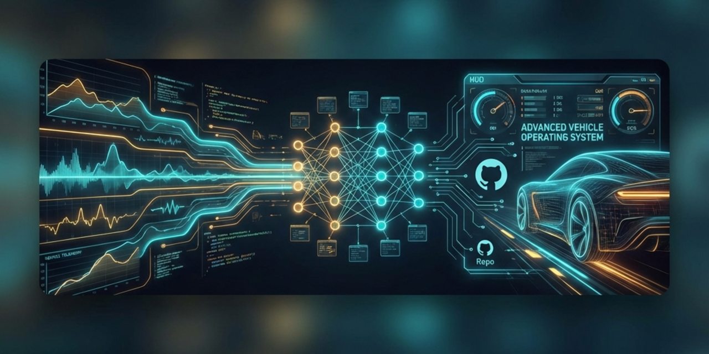

  

  
  <h1>Vehicall OS</h1>

### 🚗 The Next-Generation Open Source Vehicle Operating System

Welcome to the **Vehicall OS** organization. We are building a comprehensive, safe, and intelligent ecosystem for modern vehicles.

## 🌟 Our Ecosystem

### [VehicallOS](https://github.com/vehicall-os/VehicallOS)
The core operating system kernel and services.
- **Language**: Rust 🦀
- **Focus**: Real-time interactions, safety-critical systems, hardware fusion, and secure vehicle networking.

### [autosense_apps](https://github.com/vehicall-os/autosense_apps)
The application layer and mobile companion.
- **Framework**: Flutter 🦋
- **Focus**: Driver monitoring, user interaction, telemetrics visualization, and smartphone integration.

## 🚀 Mission
To democratize advanced driver assistance systems (ADAS) and create a unified, secure platform for connected vehicles.

## 🤝 Contribute
We welcome contributions! Please check the `CONTRIBUTING.md` in our repositories to get started.
